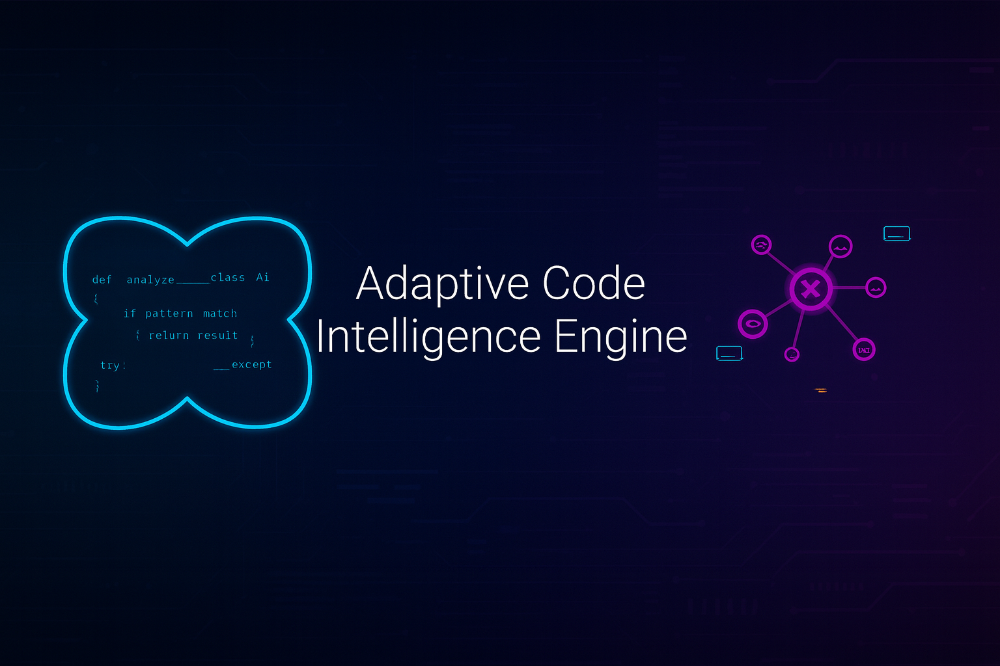

<p align="center">
  
</p>

**🧠 AI-Powered Code Analysis & Personalized Development Assistance**

*Learn your patterns, predict bugs, suggest optimizations - all on your mobile device*

</div>

---

## 🚀 What It Does

- **🔍 Advanced Code Analysis** - AST-based parsing with comprehensive quality scoring
- **🐛 Bug Prediction** - Proactive identification of potential issues before they happen
- **💡 Smart Suggestions** - Context-aware optimization and refactoring recommendations  
- **👤 Developer Profiling** - Learns your coding style and adapts suggestions accordingly

## ⚡ Quick Start

```bash
# Run the comprehensive demo
python adaptive_code_intelligence_mvp.py

# Analyze your code
aci = AdaptiveCodeIntelligence()
analysis = aci.analyze_file("your_script.py")
print(f"Quality Score: {analysis['code_quality_score']:.1f}/100")
```

## 🎯 Key Features

| Feature | Description |
|---------|-------------|
| **Pattern Recognition** | Learns from your coding patterns and evolves suggestions |
| **Quality Scoring** | Comprehensive 0-100 code quality assessment |
| **Bug Detection** | Identifies potential issues with confidence scoring |
| **Performance Optimization** | Suggests improvements for better code efficiency |

## 📊 Demo Results

```bash
=== Adaptive Code Intelligence Engine MVP Demo ===

✓ Analysis complete. Quality score: 85.2/100
Patterns Learned: 15
Bug Predictions: 23  
Suggestions Generated: 12
Files Analyzed: 3

Bug Predictions (8 found):
  1. Line 12: bare_except (high confidence: 0.85)
     Fix → Specify exception types instead of bare except

  2. Line 3: unused_variable (medium confidence: 0.65)  
     Fix → Remove unused variable or add underscore prefix

Code Suggestions (4 found):
  1. Optimization: repeated_calculation (confidence: 0.80)
     Suggestion → Cache expensive calculations to improve performance
```

## 🎯 Use Cases

- **Personal Development** - Track code quality improvement and learn best practices
- **Team Code Review** - Automated quality assessment and consistency checking
- **Educational Use** - Student code assessment with personalized feedback  
- **Enterprise Quality Gates** - Integrate into CI/CD for automated quality thresholds

## 🧠 Adaptive Intelligence

**Learns Your Style:**
- Documentation preferences
- Function complexity patterns  
- Error handling approaches
- Optimization priorities

**Evolves Over Time:**
- Pattern recognition improves with more code
- Suggestions become more personalized
- Bug predictions get more accurate
- Quality scoring adapts to your standards

## 📱 Mobile-First Design

- **Zero Dependencies** - Pure Python with standard library only
- **Efficient Processing** - Sub-second analysis for typical files
- **Local Storage** - All analysis data stays on your device
- **Battery Conscious** - Minimal computational overhead

**Tested on:** Samsung Galaxy S24 with Pydroid 3

## 📁 Files

- `adaptive_code_intelligence_mvp.py` - Complete AI analysis system
- `README.md` - Comprehensive technical documentation
- `LICENSE` - MIT License

## 🏆 Technical Excellence

This project demonstrates expertise in:
- **AST-Based Code Analysis** with comprehensive metric extraction
- **Machine Learning Pattern Recognition** with adaptive learning
- **Mobile-Optimized Architecture** for resource-constrained environments
- **Predictive Modeling** for proactive bug detection and quality assessment

<h2>👤 About the Author</h2>
  <p><strong>Justin Lane</strong><br/>
  🔗 GitHub: <a href="https://github.com/aiwithjusl" target="_blank">@aiwithjusl</a><br/>
  🔗 LinkedIn: <a href="https://www.linkedin.com/in/justin-lane-69b960219" target="_blank">Justin Lane</a><br/>
  📬 Email: <a href="mailto:aiwithjusl.dev@gmail.com">aiwithjusl.dev@gmail.com</a></p>

---

<div align="center">

**⭐ Star this repo if you find it useful! ⭐**

*Built for senior-level software engineering and AI consulting opportunities.*

</div>
